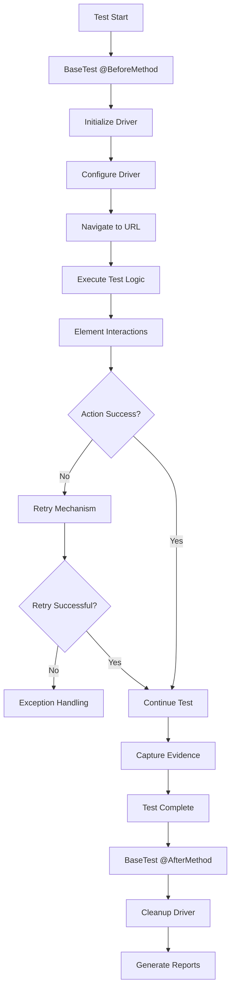
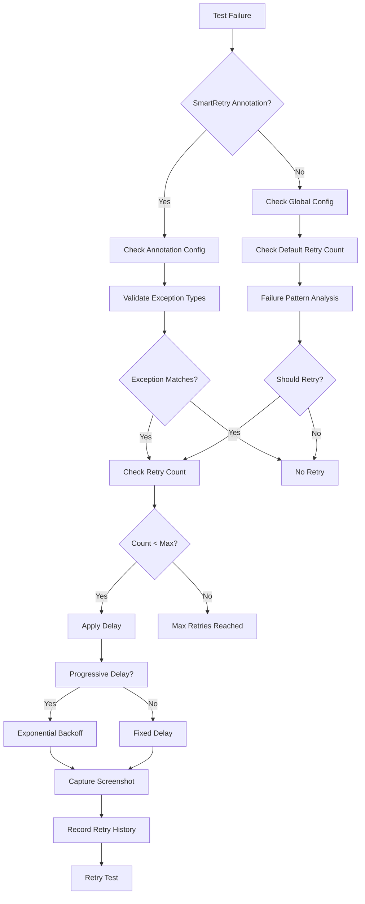

# 🏗️ Architecture Overview - Test Automation Framework

**Version**: 1.0.0  
**Last Updated**: June 2025
**Framework Status**: ✅ Production Ready

---

## 📋 Table of Contents

- [🎯 Introduction](#-introduction)
- [🏛️ Architectural Principles](#️-architectural-principles)
- [📐 System Architecture](#-system-architecture)
- [🧩 Component Design](#-component-design)
- [🔄 Data Flow & Patterns](#-data-flow--patterns)
- [🛡️ Security & Quality](#️-security--quality)
- [⚡ Performance & Scalability](#-performance--scalability)
- [🔧 Extension Points](#-extension-points)

---

## 🎯 Introduction

The Enterprise Test Automation Framework follows a **Clean Architecture** approach with clear separation of concerns, SOLID principles, and enterprise-grade design patterns. This document provides a comprehensive overview of the technical architecture, design decisions, and implementation patterns used throughout the framework.

### 🏆 Architectural Highlights
- **Layered Architecture**: Clear separation between test, framework, and infrastructure layers
- **Thread-Safe Design**: ThreadLocal patterns enabling parallel test execution
- **Dependency Injection**: Clean dependency management with minimal coupling
- **Strategy Pattern**: Pluggable wait strategies, retry mechanisms, and browser configurations
- **Factory Pattern**: WebDriver creation and configuration management
- **Observer Pattern**: Event-driven reporting and logging
- **Singleton Pattern**: Configuration and resource management

---

## 🏛️ Architectural Principles

### 1. **SOLID Principles**

#### Single Responsibility Principle (SRP)
```java
// ✅ Good: Each class has one responsibility
public final class DriverManager {
    // Only manages WebDriver lifecycle
}

public final class ConfigLoader {
    // Only handles configuration loading
}

public final class LogManager {
    // Only manages logging operations
}
```

#### Open/Closed Principle (OCP)
```java
// ✅ Framework is open for extension, closed for modification
public interface WaitStrategy {
    WebElement waitForElement(By locator, int timeout);
}

public class FluentWaitStrategy implements WaitStrategy {
    // Implementation without modifying existing code
}
```

#### Liskov Substitution Principle (LSP)
```java
// ✅ Subtypes are substitutable for their base types
public abstract class BaseTest {
    // Common test lifecycle methods
}

public class LoginTest extends BaseTest {
    // Can be used wherever BaseTest is expected
}
```

#### Interface Segregation Principle (ISP)
```java
// ✅ Clients depend only on interfaces they use
public interface ElementLocator {
    WebElement findElement(By locator);
}

public interface ElementValidator {
    boolean isDisplayed(WebElement element);
}
```

#### Dependency Inversion Principle (DIP)
```java
// ✅ Depend on abstractions, not concretions
public class TestRunner {
    private final ConfigLoader config = ConfigLoader.getInstance();
    // Depends on abstraction (interface), not concrete implementation
}
```

### 2. **Clean Architecture Layers**

```
┌─────────────────────────────────────────────────────────────┐
│                    TEST LAYER                                │
│  ┌─────────────────┐  ┌─────────────────┐  ┌─────────────────┐ │
│  │   Test Cases    │  │  Page Objects   │  │  Step Definitions│ │
│  │  - LoginTest    │  │  - LoginPage    │  │  - LoginSteps   │ │
│  │  - SearchTest   │  │  - SearchPage   │  │  - SearchSteps  │ │
│  └─────────────────┘  └─────────────────┘  └─────────────────┘ │
└─────────────────────────────────────────────────────────────┘
                                ↓
┌─────────────────────────────────────────────────────────────┐
│                  FRAMEWORK LAYER                            │
│  ┌─────────────────┐  ┌─────────────────┐  ┌─────────────────┐ │
│  │   BaseTest      │  │ ElementActions  │  │   WaitFactory   │ │
│  │  - Lifecycle    │  │  - Smart Clicks │  │  - Wait Strats  │ │
│  │  - Setup/TDown  │  │  - Auto-Retry   │  │  - Conditions   │ │
│  └─────────────────┘  └─────────────────┘  └─────────────────┘ │
│  ┌─────────────────┐  ┌─────────────────┐  ┌─────────────────┐ │
│  │  SmartRetry     │  │ ScreenshotUtil  │  │ ExceptionHandler│ │
│  │  - Annotations  │  │  - Evidence     │  │  - Classification│ │
│  │  - Analysis     │  │  - Allure Int.  │  │  - Recovery     │ │
│  └─────────────────┘  └─────────────────┘  └─────────────────┘ │
└─────────────────────────────────────────────────────────────┘
                                ↓
┌─────────────────────────────────────────────────────────────┐
│               INFRASTRUCTURE LAYER                          │
│  ┌─────────────────┐  ┌─────────────────┐  ┌─────────────────┐ │
│  │ DriverManager   │  │  ConfigLoader   │  │   LogManager    │ │
│  │  - ThreadLocal  │  │  - Env Configs  │  │  - Log4J2       │ │
│  │  - Lifecycle    │  │  - Fallbacks    │  │  - Structured   │ │
│  └─────────────────┘  └─────────────────┘  └─────────────────┘ │
│  ┌─────────────────┐  ┌─────────────────┐  ┌─────────────────┐ │
│  │ DriverFactory   │  │ FrameworkConst  │  │   RetryHistory  │ │
│  │  - Multi-Browse │  │  - Constants    │  │  - Tracking     │ │
│  │  - WebDrvMgr    │  │  - Centralized  │  │  - Analytics    │ │
│  └─────────────────┘  └─────────────────┘  └─────────────────┘ │
└─────────────────────────────────────────────────────────────┘
```

---

## 📐 System Architecture

### 1. **Thread-Safe Parallel Execution Architecture**

```java
// ThreadLocal pattern ensures thread safety
public final class DriverManager {
    private static final ThreadLocal<WebDriver> driverThreadLocal = new ThreadLocal<>();
    private static final ThreadLocal<String> browserTypeThreadLocal = new ThreadLocal<>();
    
    public static void setDriver(WebDriver driver) {
        driverThreadLocal.set(driver);
    }
    
    public static WebDriver getDriver() {
        return driverThreadLocal.get();
    }
    
    public static void quitDriver() {
        WebDriver driver = driverThreadLocal.get();
        if (driver != null) {
            driver.quit();
            driverThreadLocal.remove(); // Prevent memory leaks
            browserTypeThreadLocal.remove();
        }
    }
}
```

### 2. **Configuration Management Architecture**

```java
// Singleton pattern with thread-safe initialization
public final class ConfigLoader {
    private static ConfigLoader instance;
    private static final Object lock = new Object();
    private Properties properties;
    
    // Double-checked locking for thread safety
    public static ConfigLoader getInstance() {
        if (instance == null) {
            synchronized (lock) {
                if (instance == null) {
                    instance = new ConfigLoader();
                }
            }
        }
        return instance;
    }
    
    // Environment-specific configuration loading
    private void loadConfiguration() {
        String environment = getEnvironment();
        String configFile = getEnvironmentPropertiesFile(environment);
        loadPropertiesFile(configFile);
    }
}
```

### 3. **Intelligent Retry Architecture**

```java
// Hybrid approach: Annotation-based + Configuration-based
@SmartRetry(maxRetries = 3, retryOn = {TimeoutException.class})
public void testWithAnnotationRetry() {
    // Annotation-based retry configuration
}

// Framework-level configuration-based retry
public class SmartRetryAnalyzer implements IRetryAnalyzer {
    private static final ConcurrentHashMap<String, AtomicInteger> retryCountMap = 
        new ConcurrentHashMap<>();
    
    @Override
    public boolean retry(ITestResult result) {
        // Intelligent failure analysis and retry decision
        return shouldRetryBasedOnFailureAnalysis(result.getThrowable());
    }
}
```

---

## 🧩 Component Design

### 1. **Driver Management Components**

#### DriverFactory (Factory Pattern)
```java
public final class DriverFactory {
    
    public static WebDriver createDriver() {
        String browserType = ConfigLoader.getInstance().getBrowser();
        return createDriver(browserType);
    }
    
    public static WebDriver createDriver(String browserType) {
        return switch (browserType.toLowerCase()) {
            case CHROME -> createChromeDriver();
            case FIREFOX -> createFirefoxDriver();
            case SAFARI -> createSafariDriver();
            case EDGE -> createEdgeDriver();
            default -> throw new IllegalArgumentException("Unsupported browser: " + browserType);
        };
    }
    
    private static WebDriver createChromeDriver() {
        WebDriverManager.chromedriver().setup();
        ChromeOptions options = new ChromeOptions();
        configureChromeOptions(options);
        return new ChromeDriver(options);
    }
}
```

#### DriverManager (Singleton + ThreadLocal Pattern)
```java
public final class DriverManager {
    
    // Thread-safe driver storage
    private static final ThreadLocal<WebDriver> driverThreadLocal = new ThreadLocal<>();
    
    // Session management
    public static WebDriver initializeDriver() {
        WebDriver driver = DriverFactory.createDriver();
        setDriver(driver);
        configureDriver(driver);
        return driver;
    }
    
    // Automatic cleanup to prevent memory leaks
    public static void quitDriver() {
        // Implementation ensures proper cleanup
    }
}
```

### 2. **Element Interaction Components**

#### ElementActions (Strategy + Command Pattern)
```java
public final class ElementActions {
    
    // Strategy pattern for different interaction approaches
    public static void smartClick(By locator, String description) {
        executeWithRetry(
            () -> {
                WebElement element = WaitFactory.waitForElementClickable(locator);
                element.click();
                return true;
            },
            "click",
            description,
            locator
        );
    }
    
    // Command pattern with retry mechanism
    private static <T> T executeWithRetry(ActionFunction<T> action, 
                                         String actionType, 
                                         String description, 
                                         Object locator) {
        // Implementation with intelligent retry and recovery
    }
}
```

#### WaitFactory (Factory + Strategy Pattern)
```java
public final class WaitFactory {
    
    // Factory methods for different wait strategies
    public static WebDriverWait createWebDriverWait(int timeoutInSeconds) {
        return new WebDriverWait(DriverManager.getDriver(), Duration.ofSeconds(timeoutInSeconds));
    }
    
    public static Wait<WebDriver> createFluentWait(int timeoutInSeconds, int pollingIntervalInSeconds) {
        return new FluentWait<>(DriverManager.getDriver())
                .withTimeout(Duration.ofSeconds(timeoutInSeconds))
                .pollingEvery(Duration.ofSeconds(pollingIntervalInSeconds))
                .ignoring(NoSuchElementException.class);
    }
    
    // Strategy pattern for different wait conditions
    public static WebElement waitForElementVisible(By locator, int timeoutInSeconds) {
        return createWebDriverWait(timeoutInSeconds)
                .until(ExpectedConditions.visibilityOfElementLocated(locator));
    }
}
```

### 3. **Reporting & Evidence Components**

#### ScreenshotUtil (Utility + Observer Pattern)
```java
public final class ScreenshotUtil {
    
    // Observer pattern for event-driven screenshot capture
    public static String captureScreenshot(String scenarioName) {
        try {
            WebDriver driver = DriverManager.getDriver();
            TakesScreenshot screenshot = (TakesScreenshot) driver;
            byte[] screenshotBytes = screenshot.getScreenshotAs(OutputType.BYTES);
            
            String fileName = generateScreenshotFileName(scenarioName);
            String filePath = saveScreenshot(screenshotBytes, fileName);
            
            // Allure integration
            Allure.addAttachment(scenarioName, "image/png", 
                new ByteArrayInputStream(screenshotBytes), "png");
            
            return filePath;
        } catch (Exception e) {
            LogManager.error("Screenshot capture failed: {}", e.getMessage());
            return null;
        }
    }
}
```

### 4. **Exception Handling Components**

#### FrameworkExceptionHandler (Chain of Responsibility Pattern)
```java
public final class FrameworkExceptionHandler {
    
    public static void handleException(Throwable exception, String context, String testName) {
        ExceptionCategory category = classifyException(exception);
        
        // Chain of responsibility for exception handling
        switch (category) {
            case ELEMENT_NOT_FOUND -> handleElementNotFoundException(exception, context, testName);
            case TIMEOUT -> handleTimeoutException(exception, context, testName);
            case WEBDRIVER_ERROR -> handleWebDriverException(exception, context, testName);
            default -> handleGenericException(exception, context, testName);
        }
        
        // Common actions for all exceptions
        captureEvidence(exception, context, testName);
        recordStatistics(exception, category);
        suggestRecovery(category);
    }
    
    private static ExceptionCategory classifyException(Throwable exception) {
        // Intelligent exception classification logic
    }
}
```

---

## 🔄 Data Flow & Patterns

### 1. **Test Execution Flow**



### 2. **Configuration Loading Flow**

```mermaid
graph TD
    A[Application Start] --> B[ConfigLoader.getInstance()]
    B --> C[Load application.properties]
    C --> D[Detect Environment]
    D --> E[Load Environment Config]
    E --> F[Override Base Properties]
    F --> G[Type Conversion]
    G --> H[Validation]
    H --> I[Configuration Ready]
    
    D --> J{Environment?}
    J -->|dev| K[dev.properties]
    J -->|qa| L[qa.properties]
    J -->|staging| M[staging.properties]
    J -->|prod| N[prod.properties]
    
    K --> E
    L --> E
    M --> E
    N --> E
```

### 3. **Retry Decision Flow**



---

## 🛡️ Security & Quality

### 1. **Security Measures**

#### Secure Configuration Management
```java
public class SecureConfigUtil {
    
    // Base64 encoding for sensitive data
    public static String decryptPassword(String encodedPassword) {
        byte[] decodedBytes = Base64.getDecoder().decode(encodedPassword);
        return new String(decodedBytes);
    }
    
    // Environment variable fallback
    public static String getSecureProperty(String key) {
        String value = System.getenv(key.toUpperCase().replace('.', '_'));
        if (value != null) {
            return value;
        }
        return ConfigLoader.getInstance().getProperty(key);
    }
}
```

#### Thread Safety Implementation
```java
// Thread-safe singleton with double-checked locking
public static ConfigLoader getInstance() {
    if (instance == null) {
        synchronized (lock) {
            if (instance == null) {
                instance = new ConfigLoader();
            }
        }
    }
    return instance;
}

// Thread-safe collections for concurrent access
private static final ConcurrentHashMap<String, AtomicInteger> retryCountMap = 
    new ConcurrentHashMap<>();
private static final CopyOnWriteArrayList<RetryAttempt> attempts = 
    new CopyOnWriteArrayList<>();
```

### 2. **Quality Assurance**

#### Input Validation
```java
public static void setDriver(WebDriver driver) {
    if (driver == null) {
        LogManager.error("Attempted to set null driver for thread: {}", getCurrentThreadId());
        throw new IllegalArgumentException("WebDriver cannot be null");
    }
    driverThreadLocal.set(driver);
}
```

#### Error Handling with Recovery
```java
private static void tryRecoveryStrategies(String actionType, String description, int attemptNumber) {
    LogManager.warn("Attempting recovery strategy {} for action: {} (attempt {})", 
        attemptNumber, actionType, attemptNumber);
    
    switch (attemptNumber) {
        case 1 -> {
            // First recovery: Wait and try again
            WaitFactory.sleep(1000);
        }
        case 2 -> {
            // Second recovery: Scroll to element
            WebElement element = WaitFactory.waitForElementPresent(locator);
            scrollToElement(element);
        }
        case 3 -> {
            // Third recovery: JavaScript interaction
            // Implementation depends on action type
        }
    }
}
```

---

## ⚡ Performance & Scalability

### 1. **Parallel Execution Architecture**

#### Thread Pool Management
```xml
<!-- TestNG parallel execution configuration -->
<suite name="ParallelTestSuite" parallel="methods" thread-count="5">
    <test name="ParallelTests">
        <classes>
            <class name="com.automation.tests.LoginTest"/>
            <class name="com.automation.tests.SearchTest"/>
        </classes>
    </test>
</suite>
```

#### Resource Management
```java
// Automatic resource cleanup
public static void quitDriver() {
    WebDriver driver = driverThreadLocal.get();
    if (driver != null) {
        try {
            driver.quit();
        } finally {
            // Always clean up ThreadLocal to prevent memory leaks
            driverThreadLocal.remove();
            browserTypeThreadLocal.remove();
        }
    }
}
```

### 2. **Performance Optimizations**

#### Smart Wait Strategies
```java
// Optimized wait with custom polling
public static Wait<WebDriver> createFluentWait(int timeoutInSeconds, int pollingIntervalInSeconds) {
    return new FluentWait<>(DriverManager.getDriver())
            .withTimeout(Duration.ofSeconds(timeoutInSeconds))
            .pollingEvery(Duration.ofSeconds(pollingIntervalInSeconds))
            .ignoring(NoSuchElementException.class)
            .ignoring(StaleElementReferenceException.class);
}
```

#### Lazy Loading Configuration
```java
// Configuration loaded only when needed
public String getProperty(String key) {
    if (properties == null) {
        loadConfiguration();
    }
    return properties.getProperty(key);
}
```

---

## 🔧 Extension Points

### 1. **Custom Wait Conditions**

```java
// Extend wait functionality
public class CustomExpectedConditions {
    
    public static ExpectedCondition<Boolean> elementToHaveClass(
            final By locator, final String className) {
        return driver -> {
            try {
                String classes = driver.findElement(locator).getAttribute("class");
                return classes != null && classes.contains(className);
            } catch (Exception e) {
                return false;
            }
        };
    }
}
```

### 2. **Custom Retry Strategies**

```java
// Create custom retry annotations
@Retention(RetentionPolicy.RUNTIME)
@Target(ElementType.METHOD)
public @interface ApiRetry {
    int maxRetries() default 3;
    int[] retryOnStatusCodes() default {500, 502, 503, 504};
    boolean exponentialBackoff() default true;
}
```

### 3. **Custom Element Actions**

```java
// Extend element interaction capabilities
public final class MobileElementActions extends ElementActions {
    
    public static void swipeLeft(By locator, String description) {
        executeWithRetry(
            () -> {
                WebElement element = WaitFactory.waitForElementVisible(locator);
                // Mobile-specific swipe implementation
                return true;
            },
            "swipe-left",
            description,
            locator
        );
    }
}
```

### 4. **Custom Reporting**

```java
// Extend reporting capabilities
public class CustomAllureListener implements ITestListener {
    
    @Override
    public void onTestFailure(ITestResult result) {
        // Custom failure handling
        captureEnvironmentInfo();
        captureBrowserLogs();
        captureNetworkTraffic();
    }
}
```

---

## 📊 Architecture Benefits

### 1. **Maintainability**
- **Clear Separation of Concerns**: Each component has a single responsibility
- **Loose Coupling**: Components interact through well-defined interfaces
- **High Cohesion**: Related functionality is grouped together
- **Comprehensive Documentation**: JavaDoc and inline comments

### 2. **Scalability**
- **Thread-Safe Design**: Supports parallel test execution
- **Resource Management**: Efficient memory and resource usage
- **Configuration Management**: Environment-specific scaling
- **Modular Architecture**: Easy to add new components

### 3. **Reliability**
- **Robust Error Handling**: Comprehensive exception management
- **Intelligent Retry**: Failure pattern analysis and recovery
- **Evidence Capture**: Automatic screenshot and logging
- **Quality Gates**: Input validation and error checking

### 4. **Extensibility**
- **Plugin Architecture**: Easy to add new capabilities
- **Strategy Patterns**: Pluggable implementations
- **Factory Methods**: Easy to add new browser types
- **Event-Driven Design**: Easy to add listeners and handlers

---

**Architecture Document Version**: 1.0.0  
**Framework Version**: 1.0.0  
**Last Updated**: December 2024

*Architecture designed for enterprise-scale test automation with performance, reliability, and maintainability at its core.*

---

**Developed by**: SDETQATestAutomation Team  
**Contact**: prashant.ranjan.qa@gmail.com  
**GitHub**: https://github.com/SDETQATestAutomation/Testveriq  
**YouTube Channel**: https://www.youtube.com/@sdet-qatestautomation7214 
