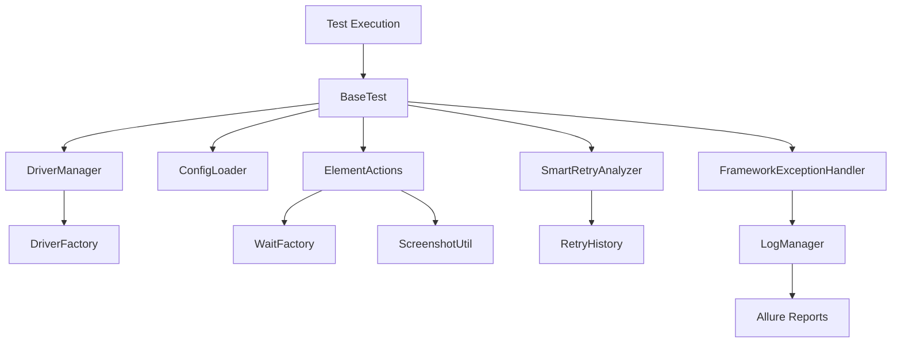

# 📖 Developer Guide - Test Automation Framework

**Version**: 1.0.0  
**Last Updated**: December 2024  
**Framework Status**: ✅ Production Ready

---

## 📋 Table of Contents

- [🎯 Introduction](#-introduction)
- [🛠️ Development Setup](#️-development-setup)
- [🏗️ Framework Architecture](#️-framework-architecture)
- [📝 Writing Tests](#-writing-tests)
- [🧩 Extending the Framework](#-extending-the-framework)
- [🔧 Configuration Management](#-configuration-management)
- [🔍 Debugging & Troubleshooting](#-debugging--troubleshooting)
- [📊 Best Practices](#-best-practices)
- [🚀 Advanced Features](#-advanced-features)
- [🧪 Testing Guidelines](#-testing-guidelines)

---

## 🎯 Introduction

This guide provides comprehensive information for developers working with the Enterprise Test Automation Framework. Whether you're writing new tests, extending framework capabilities, or maintaining existing code, this guide will help you understand the framework's architecture and best practices.

### 🏆 Framework Highlights
- **Thread-Safe**: Parallel execution ready with ThreadLocal patterns
- **Intelligent Retry**: Hybrid annotation + configuration-based retry system
- **Multi-Environment**: Dev/QA/Staging/Prod configuration management
- **Comprehensive Logging**: Structured Log4J2 with detailed tracing
- **Smart Element Interactions**: Auto-recovery with JavaScript fallbacks
- **Enterprise-Grade**: 96/100 quality score with production approval

---

## 🛠️ Development Setup

### Prerequisites
```bash
# Required Software
Java 17+
Maven 3.8+
Git 2.30+

# Recommended IDEs
IntelliJ IDEA 2023.1+
Eclipse 2023-03+
VS Code with Java Extensions
```

### Environment Setup
1. **Clone and Setup**
```bash
git clone https://github.com/SDETQATestAutomation/Testveriq.git
cd Testveriq
mvn clean install
```

2. **IDE Configuration**
```java
// IntelliJ IDEA Settings
// File > Settings > Build, Execution, Deployment > Build Tools > Maven
// - Maven home directory: Point to your Maven installation
// - User settings file: ~/.m2/settings.xml
// - Local repository: ~/.m2/repository

// Code Style
// File > Settings > Editor > Code Style > Java
// - Import: GoogleStyle.xml (available in docs/codestyle/)
```

3. **Environment Variables**
```bash
# Add to ~/.bashrc or ~/.zshrc
export JAVA_HOME=/path/to/java17
export MAVEN_HOME=/path/to/maven
export PATH=$JAVA_HOME/bin:$MAVEN_HOME/bin:$PATH

# Framework-specific (optional)
export TEST_ENVIRONMENT=qa
export TEST_BROWSER=chrome
export TEST_HEADLESS=false
```

---

## 🏗️ Framework Architecture

### Core Components Overview

#### 1. **Infrastructure Layer**
```java
// ConfigLoader - Singleton configuration management
ConfigLoader config = ConfigLoader.getInstance();
String baseUrl = config.getBaseUrl();
int timeout = config.getExplicitWaitTimeout();

// DriverManager - Thread-safe WebDriver management
DriverManager.initializeDriver("chrome");
WebDriver driver = DriverManager.getDriver();
DriverManager.quitDriver();

// LogManager - Structured logging
LogManager.info("Test started: {}", testName);
LogManager.error("Test failed", exception);
```

#### 2. **Framework Layer**
```java
// BaseTest - Test lifecycle management
public class MyTest extends BaseTest {
    @Test
    public void testExample() {
        // Framework handles setup/teardown automatically
        navigateTo(getBaseUrl());
        // Test implementation
    }
}

// ElementActions - Smart element interactions
ElementActions.click(By.id("button"));
ElementActions.sendKeys(By.id("input"), "text");
String text = ElementActions.getText(By.id("element"));

// WaitFactory - Intelligent wait strategies
WaitFactory.waitForElementToBeClickable(By.id("button"), 10);
WaitFactory.waitForTextToBePresentInElement(By.id("status"), "Complete");
```

#### 3. **Advanced Features**
```java
// SmartRetry - Intelligent retry mechanism
@Test
@SmartRetry(maxRetries = 3, retryOn = {TimeoutException.class})
public void testWithRetry() {
    // Test implementation with automatic retry
}

// ScreenshotUtil - Evidence capture
String screenshotPath = ScreenshotUtil.captureScreenshot("test_evidence");
ScreenshotUtil.captureFailureScreenshot("test_failure");

// FrameworkExceptionHandler - Global exception handling
// Automatically handles exceptions and provides recovery suggestions
```

### Data Flow Architecture


---

## 📝 Writing Tests

### 1. Basic Test Structure
```java
package com.automation.tests;

import com.automation.framework.base.BaseTest;
import com.automation.framework.utils.ElementActions;
import com.automation.framework.retry.SmartRetry;
import org.openqa.selenium.By;
import org.testng.annotations.Test;
import org.testng.Assert;
import io.qameta.allure.Description;
import io.qameta.allure.Severity;
import io.qameta.allure.SeverityLevel;

public class LoginTest extends BaseTest {
    
    @Test(groups = {"smoke", "regression"})
    @Description("Verify user can login with valid credentials")
    @Severity(SeverityLevel.CRITICAL)
    @SmartRetry(maxRetries = 2, delayBetweenRetries = 1000)
    public void testValidLogin() {
        // Navigate to application
        navigateTo(getBaseUrl() + "/login");
        
        // Perform login actions
        ElementActions.sendKeys(By.id("username"), "testuser");
        ElementActions.sendKeys(By.id("password"), "testpass");
        ElementActions.click(By.id("loginButton"));
        
        // Verify successful login
        String welcomeMessage = ElementActions.getText(By.id("welcomeMessage"));
        Assert.assertTrue(welcomeMessage.contains("Welcome"), 
            "Login failed - welcome message not found");
    }
    
    @Test(groups = {"smoke"})
    @Description("Verify error message for invalid credentials")
    @Severity(SeverityLevel.NORMAL)
    public void testInvalidLogin() {
        navigateTo(getBaseUrl() + "/login");
        
        ElementActions.sendKeys(By.id("username"), "invaliduser");
        ElementActions.sendKeys(By.id("password"), "invalidpass");
        ElementActions.click(By.id("loginButton"));
        
        String errorMessage = ElementActions.getText(By.id("errorMessage"));
        Assert.assertEquals(errorMessage, "Invalid credentials", 
            "Error message mismatch");
    }
}
```

### 2. Page Object Pattern Implementation
```java
package com.automation.pages;

import com.automation.framework.utils.ElementActions;
import com.automation.framework.utils.WaitFactory;
import org.openqa.selenium.By;
import io.qameta.allure.Step;

public class LoginPage {
    
    // Page elements
    private final By usernameField = By.id("username");
    private final By passwordField = By.id("password");
    private final By loginButton = By.id("loginButton");
    private final By errorMessage = By.id("errorMessage");
    private final By welcomeMessage = By.id("welcomeMessage");
    
    @Step("Login with username: {username}")
    public void login(String username, String password) {
        ElementActions.sendKeys(usernameField, username);
        ElementActions.sendKeys(passwordField, password);
        ElementActions.click(loginButton);
    }
    
    @Step("Verify login success")
    public boolean isLoginSuccessful() {
        WaitFactory.waitForElementToBeVisible(welcomeMessage, 10);
        return ElementActions.isDisplayed(welcomeMessage);
    }
    
    @Step("Get error message")
    public String getErrorMessage() {
        WaitFactory.waitForElementToBeVisible(errorMessage, 5);
        return ElementActions.getText(errorMessage);
    }
}
```

### 3. Data-Driven Testing
```java
package com.automation.tests;

import com.automation.framework.base.BaseTest;
import com.automation.pages.LoginPage;
import org.testng.annotations.DataProvider;
import org.testng.annotations.Test;

public class LoginDataDrivenTest extends BaseTest {
    
    private LoginPage loginPage = new LoginPage();
    
    @DataProvider(name = "loginData")
    public Object[][] getLoginData() {
        return new Object[][] {
            {"validuser1", "validpass1", true},
            {"validuser2", "validpass2", true},
            {"invaliduser", "invalidpass", false},
            {"", "", false}
        };
    }
    
    @Test(dataProvider = "loginData")
    public void testLoginWithMultipleCredentials(String username, 
                                               String password, 
                                               boolean expectedResult) {
        navigateTo(getBaseUrl() + "/login");
        
        loginPage.login(username, password);
        
        boolean actualResult = loginPage.isLoginSuccessful();
        Assert.assertEquals(actualResult, expectedResult, 
            String.format("Login result mismatch for %s/%s", username, password));
    }
}
```

---

## 🧩 Extending the Framework

### 1. Adding New Utility Classes
```java
package com.automation.framework.utils;

import com.automation.framework.utils.LogManager;
import org.openqa.selenium.JavascriptExecutor;
import org.openqa.selenium.WebDriver;

/**
 * JavaScript utility for advanced browser interactions
 */
public final class JavaScriptUtil {
    
    private JavaScriptUtil() {
        throw new UnsupportedOperationException("Utility class");
    }
    
    /**
     * Execute JavaScript code
     */
    public static Object executeScript(String script, Object... args) {
        try {
            WebDriver driver = DriverManager.getDriver();
            JavascriptExecutor jsExecutor = (JavascriptExecutor) driver;
            LogManager.debug("Executing JavaScript: {}", script);
            return jsExecutor.executeScript(script, args);
        } catch (Exception e) {
            LogManager.error("JavaScript execution failed: {}", e.getMessage());
            throw new RuntimeException("JavaScript execution failed", e);
        }
    }
    
    /**
     * Scroll element into view
     */
    public static void scrollIntoView(WebElement element) {
        executeScript("arguments[0].scrollIntoView(true);", element);
        LogManager.debug("Scrolled element into view");
    }
}
```

### 2. Custom Wait Conditions
```java
package com.automation.framework.utils;

import org.openqa.selenium.support.ui.ExpectedCondition;
import org.openqa.selenium.WebDriver;
import org.openqa.selenium.By;

public class CustomExpectedConditions {
    
    /**
     * Wait for element to have specific CSS class
     */
    public static ExpectedCondition<Boolean> elementToHaveClass(
            final By locator, final String className) {
        return new ExpectedCondition<Boolean>() {
            @Override
            public Boolean apply(WebDriver driver) {
                try {
                    String classes = driver.findElement(locator)
                                         .getAttribute("class");
                    return classes != null && classes.contains(className);
                } catch (Exception e) {
                    return false;
                }
            }
            
            @Override
            public String toString() {
                return String.format("element located by %s to have class '%s'", 
                                   locator, className);
            }
        };
    }
}
```

### 3. Custom Retry Strategies
```java
package com.automation.framework.retry;

import java.lang.annotation.ElementType;
import java.lang.annotation.Retention;
import java.lang.annotation.RetentionPolicy;
import java.lang.annotation.Target;

/**
 * Custom retry annotation for API tests
 */
@Retention(RetentionPolicy.RUNTIME)
@Target(ElementType.METHOD)
public @interface ApiRetry {
    int maxRetries() default 3;
    long delayBetweenRetries() default 1000;
    int[] retryOnStatusCodes() default {500, 502, 503, 504};
    boolean exponentialBackoff() default false;
}
```

---

## 🔧 Configuration Management

### 1. Environment-Specific Properties
```properties
# src/test/resources/config/qa.properties
# Application URLs
base.url=https://qa.example.com
api.base.url=https://api.qa.example.com
database.url=jdbc:mysql://qa-db.example.com:3306/testdb

# Authentication
default.username=qauser
default.password=qapass123

# Browser Configuration
browser=chrome
headless=false
window.maximize=true
browser.options=--disable-dev-shm-usage,--no-sandbox

# Timeouts
implicit.wait.timeout=10
explicit.wait.timeout=20
page.load.timeout=30
fluent.wait.timeout=15
polling.interval=2

# Retry Configuration
retry.count=2
retry.delay=1000
retry.progressive.delay=true
retry.max.delay=5000

# Screenshot Configuration
screenshot.on.failure=true
screenshot.on.success=false
screenshot.on.retry=true
screenshot.cleanup.days=7

# Logging Configuration
log.level=INFO
log.to.console=true
log.to.file=true
log.file.path=logs/automation.log
log.max.file.size=10MB
log.max.files=10
```

### 2. Runtime Configuration Override
```java
// Using system properties
System.setProperty("browser", "firefox");
System.setProperty("headless", "true");
System.setProperty("environment", "staging");

// Using ConfigLoader programmatically
ConfigLoader config = ConfigLoader.getInstance();

// Override specific properties
config.setProperty("base.url", "https://custom.example.com");
config.setProperty("retry.count", "5");

// Reload configuration
config.reloadConfiguration();
```

### 3. Secure Configuration Management
```java
package com.automation.framework.config;

import java.util.Base64;

public class SecureConfigUtil {
    
    /**
     * Decrypt base64-encoded passwords
     */
    public static String decryptPassword(String encodedPassword) {
        try {
            byte[] decodedBytes = Base64.getDecoder().decode(encodedPassword);
            return new String(decodedBytes);
        } catch (Exception e) {
            LogManager.warn("Password decryption failed: {}", e.getMessage());
            return encodedPassword; // Return as-is if decryption fails
        }
    }
    
    /**
     * Get secure property with decryption
     */
    public static String getSecureProperty(String key) {
        ConfigLoader config = ConfigLoader.getInstance();
        String value = config.getProperty(key);
        
        if (key.toLowerCase().contains("password") && value != null) {
            return decryptPassword(value);
        }
        
        return value;
    }
}
```

---

## 🔍 Debugging & Troubleshooting

### 1. Debug Logging Configuration
```java
// Enable debug logging for specific test
@Test
public void testWithDebugLogging() {
    LogManager.debug("Starting test with debug logging");
    
    // Enable detailed element actions logging
    ElementActions.setDebugMode(true);
    
    try {
        // Test implementation
        ElementActions.click(By.id("button"));
    } finally {
        ElementActions.setDebugMode(false);
    }
}
```

### 2. Screenshot Debugging
```java
public class DebugTest extends BaseTest {
    
    @Test
    public void testWithStepScreenshots() {
        navigateTo(getBaseUrl());
        captureScreenshot("step_1_navigation");
        
        ElementActions.sendKeys(By.id("username"), "testuser");
        captureScreenshot("step_2_username_entered");
        
        ElementActions.sendKeys(By.id("password"), "testpass");
        captureScreenshot("step_3_password_entered");
        
        ElementActions.click(By.id("loginButton"));
        captureScreenshot("step_4_login_clicked");
    }
}
```

### 3. Element Debugging Utilities
```java
package com.automation.framework.utils;

public class DebugUtil {
    
    /**
     * Highlight element on page
     */
    public static void highlightElement(WebElement element) {
        try {
            String originalStyle = element.getAttribute("style");
            
            // Add highlight style
            JavaScriptUtil.executeScript(
                "arguments[0].style.border='3px solid red';" +
                "arguments[0].style.backgroundColor='yellow';", element);
            
            Thread.sleep(1000); // Highlight for 1 second
            
            // Restore original style
            JavaScriptUtil.executeScript(
                "arguments[0].style.cssText=arguments[1];", 
                element, originalStyle);
                
        } catch (Exception e) {
            LogManager.warn("Element highlighting failed: {}", e.getMessage());
        }
    }
    
    /**
     * Get element information for debugging
     */
    public static String getElementInfo(WebElement element) {
        try {
            return String.format(
                "Tag: %s, Text: %s, Visible: %s, Enabled: %s, Location: %s, Size: %s",
                element.getTagName(),
                element.getText(),
                element.isDisplayed(),
                element.isEnabled(),
                element.getLocation(),
                element.getSize()
            );
        } catch (Exception e) {
            return "Element information unavailable: " + e.getMessage();
        }
    }
}
```

---

## 📊 Best Practices

### 1. Test Organization
```java
// Good: Clear test organization
package com.automation.tests.login;

@TestMethodOrder(OrderAnnotation.class)
public class LoginFunctionalityTest extends BaseTest {
    
    @Test(groups = {"smoke"}, priority = 1)
    @Description("Verify login page loads correctly")
    public void testLoginPageLoad() { /* implementation */ }
    
    @Test(groups = {"smoke", "regression"}, priority = 2)
    @Description("Verify valid user can login")
    public void testValidLogin() { /* implementation */ }
    
    @Test(groups = {"regression"}, priority = 3)
    @Description("Verify invalid credentials show error")
    public void testInvalidLogin() { /* implementation */ }
}
```

### 2. Element Locator Strategy
```java
// Good: Maintainable locator strategy
public class LoginPageLocators {
    // Priority 1: ID attributes
    public static final By USERNAME_FIELD = By.id("username");
    public static final By PASSWORD_FIELD = By.id("password");
    
    // Priority 2: Name attributes
    public static final By LOGIN_FORM = By.name("loginForm");
    
    // Priority 3: CSS selectors
    public static final By LOGIN_BUTTON = By.cssSelector("button[type='submit']");
    
    // Priority 4: XPath (use sparingly)
    public static final By ERROR_MESSAGE = By.xpath("//div[@class='error-message']");
}
```

### 3. Data Management
```java
// Good: Centralized test data management
package com.automation.testdata;

public class TestDataProvider {
    
    public static final String VALID_USERNAME = "testuser";
    public static final String VALID_PASSWORD = "testpass123";
    
    @DataProvider(name = "userCredentials")
    public static Object[][] getUserCredentials() {
        return ExcelUtil.readTestData("testdata/users.xlsx", "ValidUsers");
    }
    
    @DataProvider(name = "invalidCredentials")
    public static Object[][] getInvalidCredentials() {
        return new Object[][] {
            {"", "", "Username is required"},
            {"validuser", "", "Password is required"},
            {"invaliduser", "invalidpass", "Invalid credentials"}
        };
    }
}
```

---

## 🚀 Advanced Features

### 1. Parallel Execution Configuration
```xml
<!-- testng-parallel.xml -->
<?xml version="1.0" encoding="UTF-8"?>
<suite name="ParallelTestSuite" parallel="methods" thread-count="5">
    <listeners>
        <listener class-name="com.automation.framework.listeners.AllureListener"/>
        <listener class-name="com.automation.framework.listeners.TestRetryListener"/>
    </listeners>
    
    <test name="ParallelTests">
        <classes>
            <class name="com.automation.tests.LoginTest"/>
            <class name="com.automation.tests.NavigationTest"/>
            <class name="com.automation.tests.SearchTest"/>
        </classes>
    </test>
</suite>
```

### 2. Custom Test Listeners
```java
package com.automation.framework.listeners;

import org.testng.ITestListener;
import org.testng.ITestResult;

public class CustomTestListener implements ITestListener {
    
    @Override
    public void onTestStart(ITestResult result) {
        String testName = result.getMethod().getMethodName();
        LogManager.info("Starting test: {}", testName);
        
        // Set test context for thread
        TestContext.setCurrentTest(testName);
    }
    
    @Override
    public void onTestFailure(ITestResult result) {
        String testName = result.getMethod().getMethodName();
        Throwable exception = result.getThrowable();
        
        LogManager.error("Test failed: {}", testName, exception);
        
        // Capture additional debug information
        capturePageSource(testName);
        captureBrowserLogs(testName);
        captureNetworkLogs(testName);
    }
    
    private void capturePageSource(String testName) {
        try {
            if (DriverManager.hasDriver()) {
                String pageSource = DriverManager.getDriver().getPageSource();
                String fileName = String.format("page_source_%s_%d.html", 
                                              testName, System.currentTimeMillis());
                FileUtil.writeToFile(fileName, pageSource);
            }
        } catch (Exception e) {
            LogManager.warn("Failed to capture page source: {}", e.getMessage());
        }
    }
}
```

### 3. API Testing Integration
```java
package com.automation.framework.api;

import io.restassured.RestAssured;
import io.restassured.response.Response;

public class ApiTestBase {
    
    protected static final String API_BASE_URL = 
        ConfigLoader.getInstance().getProperty("api.base.url");
    
    @BeforeClass
    public void setupApiTesting() {
        RestAssured.baseURI = API_BASE_URL;
        RestAssured.useRelaxedHTTPSValidation();
    }
    
    protected Response makeGetRequest(String endpoint) {
        return RestAssured.given()
                .contentType("application/json")
                .log().all()
                .when()
                .get(endpoint)
                .then()
                .log().all()
                .extract()
                .response();
    }
    
    protected Response makePostRequest(String endpoint, Object payload) {
        return RestAssured.given()
                .contentType("application/json")
                .body(payload)
                .log().all()
                .when()
                .post(endpoint)
                .then()
                .log().all()
                .extract()
                .response();
    }
}
```

---

## 🧪 Testing Guidelines

### 1. Test Naming Conventions
```java
// Good: Descriptive test names
@Test
public void testLoginWithValidCredentialsShowsWelcomePage() { }

@Test
public void testLoginWithInvalidPasswordShowsErrorMessage() { }

@Test
public void testEmptyUsernameFieldShowsValidationError() { }

// Bad: Unclear test names
@Test
public void test1() { }

@Test
public void testLogin() { }
```

### 2. Assertion Best Practices
```java
// Good: Clear assertions with meaningful messages
Assert.assertTrue(loginPage.isWelcomeMessageDisplayed(), 
    "Welcome message should be displayed after successful login");

Assert.assertEquals(loginPage.getErrorMessage(), "Invalid credentials", 
    "Error message should match expected text for invalid login");

// Use soft assertions for multiple validations
SoftAssert softAssert = new SoftAssert();
softAssert.assertTrue(element.isDisplayed(), "Element should be visible");
softAssert.assertTrue(element.isEnabled(), "Element should be enabled");
softAssert.assertAll(); // This will report all failures
```

### 3. Test Data Cleanup
```java
@AfterMethod
public void cleanupTestData() {
    // Clean up test data created during test execution
    if (testDataCreated) {
        DatabaseUtil.deleteTestUser(createdUserId);
        ApiUtil.deleteTestData(createdDataId);
    }
}

@AfterClass
public void cleanupTestFiles() {
    // Clean up temporary files
    FileUtil.cleanupTempFiles();
    ScreenshotUtil.cleanupOldScreenshots();
}
```

---

## 📞 Support & Maintenance

### Getting Help
- **Framework Documentation**: Check the `docs/` directory
- **Code Examples**: Review `src/test/java/examples/`
- **Troubleshooting**: See `docs/TROUBLESHOOTING.md`
- **Best Practices**: Review `docs/BEST_PRACTICES.md`

### Reporting Issues
1. Check existing issues and documentation
2. Provide minimal reproducible example
3. Include environment details and logs
4. Tag appropriate team members

### Contributing
1. Follow the coding standards outlined in this guide
2. Add appropriate tests for new functionality
3. Update documentation for any API changes
4. Ensure all existing tests pass

---

**Developer Guide Version**: 1.0.0  
**Framework Version**: 1.0.0  
**Last Updated**: December 2024

*Happy Testing! 🚀*

---

**Developed by**: SDETQATestAutomation Team  
**Contact**: prashant.ranjan.qa@gmail.com  
**GitHub**: https://github.com/SDETQATestAutomation  
**YouTube**: https://www.youtube.com/@sdet-qatestautomation7214 